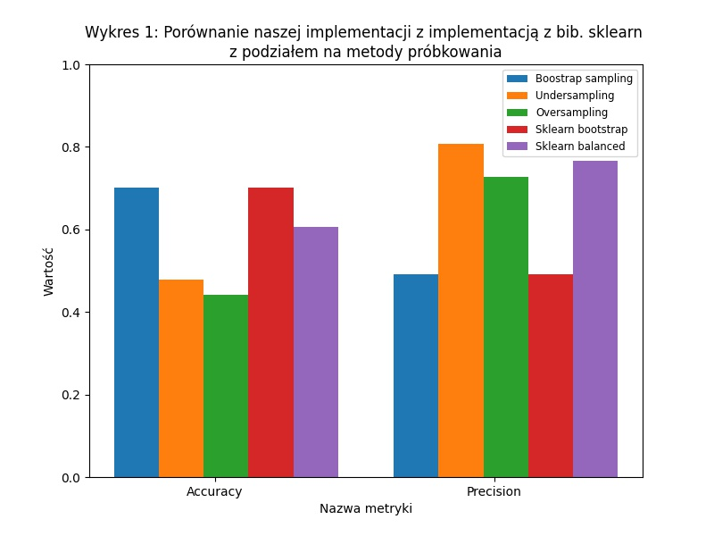
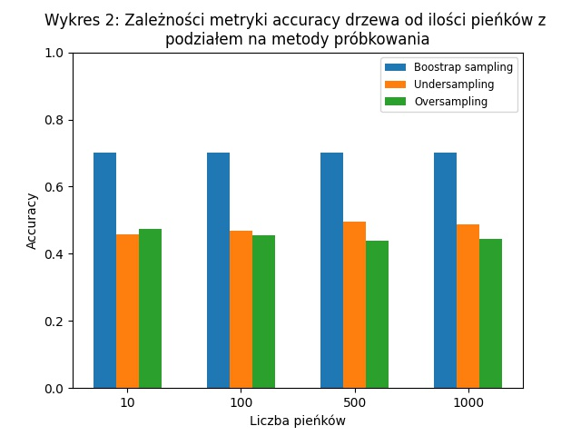
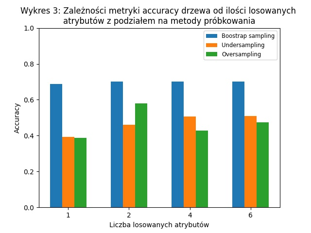

# MM.DD.K5 Random Forest - decision stumps

## Skład zespołu
- Maciej Dmowski
- Adam Szałowski

## Treść zadania
Zaimplementować algorytm lasu losowego (ang. Random Forest) do klasyfikacji oparty na modelu lasu losowego pieńków decyzyjnych (ang. decision stumps). Zbiór danych do użycia: [Car Evaluation](https://archive.ics.uci.edu/ml/datasets/Car+Evaluation). Uzyskane rezultaty porównać z wynikami dla wybranej implementacji algorytmu ML z dostępnych bibliotek np. Scikit-learn, WEKA, MLlib, Tensorflow/Keras etc.

### Analiza zbioru danych

Zbiór danych z którym pracujemy został stworzony w celu oceny samochodów na podstawie 6 atrybutów:


| Nazwa atrybutu | Możliwe wartości |
| -------- | -------- |
| buying     |   v-high, high, med, low   |
|  maint  |   v-high, high, med, low   |
|  doors |    2, 3, 4, 5-more  |
|  persons |   2, 4, more   |
|  lug_boot |   small, med, big   |
|  safety |   low, med, high   |

Dodatkowo każdy wiersz ma przypisaną jedną z 4 możliwych klas:


| Nazwa klasy | Liczba rekordów | Procentowy udział |
| -------- | -------- | -------- |
| unacc     | 1210     | 70.023%     |
| acc     | 384     | 22.222%     |
| good    | 69     | 3.993%     |
| v-good    | 65     | 3.762%     |

Łącznie w zbiorze jest więc 1728 rekordów i nie ma brakujących wartości. Możemy też zauważyć, że pomimo pełnego pokrycia przestrzeni atrybutów przez dane, rozkład klas jest bardzo niezbalansowany co utrudni odpowiednie nauczenie modelu opartego na algorytmie lasu losowego, który działa najlepiej dla zbalansowanych zbiorów danych.

### Wybrany język oraz algorytm z dostępnych bibliotek ML

Zdecydowaliśmy, że zaimplementujemy algorytm w języku Python3 oraz jako algorytm, z którym będziemy porównywać wyniki, wybraliśmy [RandomForestClassifier](https://scikit-learn.org/stable/modules/generated/sklearn.ensemble.RandomForestClassifier.html) z biblioteki [scikit-learn](https://scikit-learn.org/)

### Przyjęte założenia

Z uwagi na to, że zbiór danych z którego korzystamy zawiera tylko atrybuty kategoryczne przyjeliśmy, że nasz algorytm będzie oczekiwał danych tylko w takiej postaci. Jednakże, podczas implementacji upewniliśmy się, że w razie potrzeby dodanie obsługi atrybutów typu liczbowego (ciągłego i dyskretnego) nie sprawi większych problemów.


## Podział zadań
- Adam Szałowski - las losowy pieńków decyzyjnych, metody próbkowania(bootstrap, random oversampling, random undersampling)
- Maciej Dmowski - las losowy pieńków decyzyjnych, wpływ metod samplingu na działanie modelu  

## Opis algorytmu
Las losowy pieńków decyzyjnych jest lasem losowym złożonym z drzew o głębokości równej 1. Zaimplementowaliśmy pieńki zawierające po jednym liściu dla każdej wartości artybutu decyzyjnego. Wybór artybutu decyzyjnego dokonywany jest na podstawie indeksu Gini z wylosowanego zbioru artybutów o określonym  rozmiarze. Klasa przypisana do liścia jest najczęściej występującą klasą w podzbiorze o danej wartości atrybutu. Początkowo zaimplementowaliśmy algorytm bootstrap samplingu do generowania próbek o określonym rozmiarze w celu zróżnicowania danych dla każdego pieńka. 
Model dokonuje predykcji wybierając najczęściej występującą klasę we wskazaniach każdego z pieńków. 

### Metody próbkowania

W celu zredukowania wpływu niezbalansowania klas na model zaimplementowaliśmy dwie metody próbkowania danych mające na celu sztuczne zbalansowanie dystrybucji klas w zbiorze danych przeznaczonym do uczenia danego pieńka. Są to:

- Random Undersampling

    Metoda ta polega na losowym usunięciu rekordów o klasach innych niż klasa mniejszościowa aż    liczba wszystkich klas w danej próbce wyrówna się i będzie równa liczbie rekordów o klasie mniejszościowej.
    Metoda zaimplementowana jest w funkcji ```StumpForest.randomUnderSampling```.
    
- Random Oversampling
    Metoda ta polega na losowym duplikowaniu rekordów o klasach innych niż klasa większościowa aż liczba wszystkich klas w danej próbce wyrówna się i będzie równa liczbie rekordów w klasie większościowej.
    Metoda zaimplementowana jest w funkcji ```StumpForest.randomOverSampling```.

## Przeprowadzone eksperymenty
Zaimplementowany las losowy pieńków decyzyjnych porównywaliśmy z lasem losowym o maksymalnej głębokości drzewa = 1 z biblioteki scikit-learn. Oceniając modele korzystaliśmy z k-krotnej walidacji krzyżowej.

<center> { width=75% } </center>

**Pierwszy eksperyment** miał na celu porównanie naszego modelu zawierającego 1000 pieńków decyzyjnych z modelem RandomForestClassifier zawierającym 1000 drzew o głębokości 1. Porównywaliśmy nasz model w 3 wariantach różniących się metodami próbkowania z dwoma wariantami modelu z biblioteki - z próbkowaniem bootstrap oraz z balansowanymi wagami klas.

Zaimplementowany przez nas model korzystający z metody bootstrap zwracał identyczne wyniki jak RandomForestClassifier korzystający z tej samej metody próbkowania. Z powodu niezbalansowanego rozkładu klas w zbiorze danych, modele te przewidywały stale klasę *unacc*, która stanowi 70.023% całego zbioru danych. W związku z czym accuracy oraz recall obu modeli wynosi dokładnie 70.023%, jednakże precision wynosi jedynie 49%. Modele te zapewniały najwyższą metrykę accuracy, która w przypadku niezbalansowego rozkładu jest myląca, gdyż model zwracający jedną klasę bez względu na wejście nie pomaga w klasyfikacji.

W celu wyeliminowania stałego zwracania jednej klasy wprowadziliśmy dwie metody próbkowania a w RandomForestClassifier użyliśmy opcji balansowania wag klas. Metryka accuracy każdego z tych modeli była niższa niż w przypadku próbkowania bootstrap, jednakże nastąpił wzrost precision do poziomu 0,80. Możemy zauważyć, że wykorzystanie undersamplingu daje lepsze rezultaty od oversamplingu zarówno pod kątem accuracy jak i precision. W obu przypadkach precision klasy *unacc* wzrósł do 1.0, jednakże recall spadł do poziomu 0,59 (w porównaniu do bootstrap) - co oznacza, że model nie określa innych klas jako *unacc*, jednakże nie przewiduje również wszystkich *unacc*. Zarówno oversampling i undersampling mają tendencję do nadmiernego przewidywania najmniej licznej klasy *vgood* co skutkuje niską wartością precision dla tej klasy ale wysoką wartością recall - nawet 0,93 w przypadku undersampling. RandomForestClassifier korzystający ze zbalansowanych wag klas uzyskał lepsze wyniki accuracy oraz precision niż nasz model, jednakże cechował się podobną charakterystyką przewidywań najmniej(*vgood*) i najbardziej licznej klasy(*unacc*).

{ width=50% } \ { width=50% }
**W drugim eksperymencie** przetestowaliśmy wpływ parametrów zaimplementowanego modelu na metrykę accuracy. 
Dla każdej metody próbkowania zbadaliśmy wpływ liczby pieńków decyzyjnych oraz rozmiaru podgrupy atrybutów, z której wybierany jest atrybut decyzyjny pieńka. Zmienialiśmy tylko 1 parametr na raz - przy zmiennej liczbie pieńków rozmiar podgrupy ustawiony był na domyślną wartość = 2, przy zmiennym rozmiarze podgrupy atrybutów liczba pieńków ustawiona była na domyślną wartość = 1000.
Dla domyślnego próbkowania zmiana liczby pieńków nie miała wpływu wyniki, zastosowanie całkowicie losowego artybutu decyzyjnego w pieńkach spowodowało nieznaczny spadek accuracy, co oznacza, że model nie przewiduje jedynie klasy *unacc*. 
Próbkowanie metodą oversampligu osiąga najlepszy wynik accuracy dla liczby pieńków równej 10, gdy przy undersampling nalepszy wynik osiągany jest przy 500 pieńkach i jest on wyższy niż przy oversamplingu. Używając metody undersamplingu najlepsze rezultaty osiągnięto przy największych grupach parametrów, a przy oversamplingu zwiększenie liczby atrybutów do wyboru ponad standardowo przyjęty pierwiastek z liczby wszystkich możliwych powoduje spadek accuracy.

# Wnioski i możliwe usprawnienia

Jeśli o chodzi poprawienie naszej implementacji modelu w pierwszej kolejności warto by spojrzeć na bardziej zaawansowane metody balansowania zbioru danych jak na przykład [SMOTE](https://arxiv.org/abs/1106.1813), który generuje nowe rekordy z klas mniejszościowych na podstawie tych znajdujących się juz w zbiorze. Można by także wypróbować inne metody liczenia entropii na przykład gini z ważonymi klasami.

Stosując ten model do podejmowania decyzji o kupnie samochodu należy zauważyć, że w wersji z próbkowaniem bootstrap nie doprowadzi on do żadnego zakupu. Korzystając z undersamplingu lub oversamplingu model będzie wskazywał sugestie zakupu, jednakże mogą one być błędne. Z powodu sprowadzenia wszystkich klas do równej liczebności pojawia się problem nadmiernego przypisywania klasy mniejszościowej *vgood*. Przy podejmowaniu decyzji mniej krytyczna jest pomyłka między klasami *good* a *vgood* niż między *unacc* a *vgood* co powinniśmy uwzględnić przy doborze modelu do realizacji tego typu zadań.

# Instrukcja użytkowania

Do korzystania z zaimplementowanego modelu wymagana jest biblioteka [numpy](https://numpy.org/). Model oczekuje zbioru danych w postaci dwuwymiarowego [numpy.ndarray](https://numpy.org/doc/stable/reference/arrays.ndarray.html), gdzie ostatnia kolumna to klasa przypisana każdemu rekordowi.

Przykład użycia modelu znajduje się w pliku *helpers.py* w funkcjach *evaluateParameters* oraz *compareWithExternal*. Do ich uruchomienia potrzebne będzie dodatkowe zainstalowanie modułu *sklearn* wspomnianego wcześniej.
